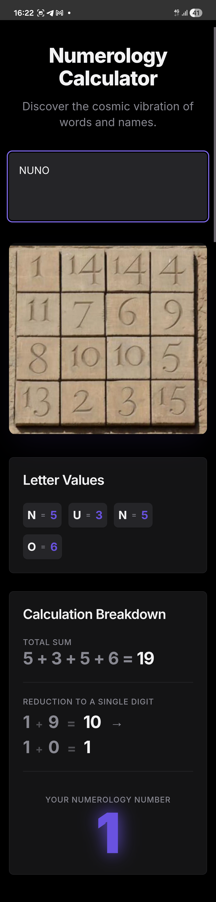

# Numerology
My first app using AI, I do not code but have learned the pintelho of C#

I study the esoteric arts sice a boy and we are in modern times.

The only thing I know about programming is the basis. I've learned it in an IT couse were one of the disciplines was programing. It was C#.

Saying this, I'm a king of "programador de algibeira", pocket programmer.

And it makes sense, I've created this app in my mobile phone with the help of an AI and I travel with my mobile in my pocket. 

And needed a Numerology app.

The app was created with the help of firebase studio, then I used median.co to create the apk.

the app go grab the image at imagestack
, this is the only internet trafic that is supposed to do, but I see MB of traffic for an about 20KB image.

At the moment I'm unable to upload all app files, so, I will upload firebase code and the APK, use it at your own risk. 

Take care.
Be.
nuromen
[!/¡]

